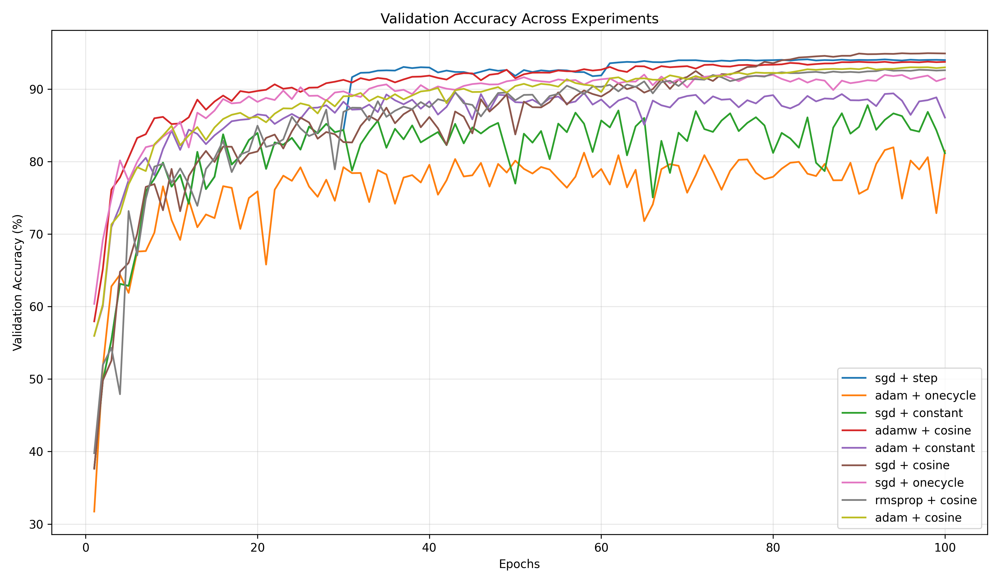

# Meta-Optimization of Learning Schedules in Deep Networks

This project investigates how different learning rate schedules and optimizers affect the training dynamics, convergence speed, and generalization of deep neural networks.

## Overview

The effectiveness of deep learning models depends heavily on optimization strategies. This project systematically analyzes:

- How different optimizers (SGD, Adam, RMSprop, AdamW) behave with various learning rate schedules  
- The impact of learning rate strategies on convergence speed and generalization  
- Gradient and weight dynamics throughout training  
- Optimization stability and robustness  

### Optimizers Compared 

- SGD (with momentum)
- Adam  
- RMSProp
- AdamW

### Learning Rate Schedulers

- Constant LR
- Step LR
- Cosine Annealing
- OneCycle LR
- Cyclic LR

### Results

| Optimizer | Scheduler | Final Val Acc (%) | Best Val Acc (%) | Best Val Epoch | Convergence Epochs | Gen Gap (%) | 
|-----------|-----------|-------------------|------------------|----------------|--------------------|-------------|
|sgd|cosine|94.92|94.96|98|25|5.05|
|sgd|step|94.01|94.11|84|26|5.97|
|adamw|cosine|93.76|93.79|98|8|6.23|
|adam|cosine|93.0|93.02|98|10|6.84|
|rmsprop|cosine|92.61|92.72|93|20|7.11|
|sgd|onecycle|91.47|92.0|65|9|6.95|
|adam|constant|86.08|89.54|43|9|7.37|
|sgd|constant|81.16|87.79|91|9|8.11|
|adam|onecycle|81.5|81.97|94|9|1.37|

--- 

